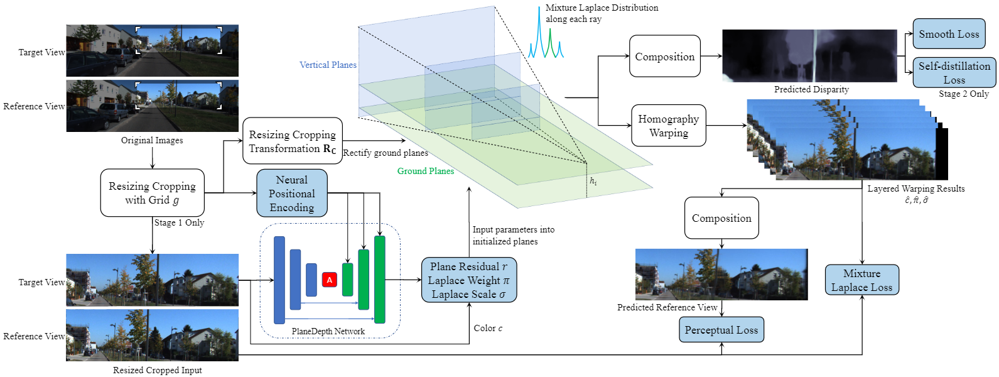

# PlaneDepth

This is the official PyTorch implementation for

> **PlaneDepth: Self-supervised Depth Estimation via Orthogonal Planes**

<p align="center">
  
</p>

## 🐁 Setup
We recommend using the conda environment with python 3.9.7 by running:
```shell
conda create -n planedepth python=3.9.7
conda activate planedepth
```
and then install the dependencies listed in requirements.txt.

## 🐂 KITTI training data
You can download the entire [raw KITTI dataset](http://www.cvlibs.net/datasets/kitti/raw_data.php) by running:
```shell
wget -i splits/kitti_archives_to_download.txt -P kitti/
```
Then unzip with
```shell
cd kitti
unzip "*.zip"
cd ..
```
You can also place the KITTI dataset wherever you like and point towards it with the `--data_path` flag during training and evaluation.

## 🐅 Training
We provide the defult stereo training command of stage1 in `train_ResNet.sh`.

To perform HRfinetune after stage1, update `train_ResNet.sh` as:
```shell
CUDA_VISIBLE_DEVICES=0,1,2,3 OMP_NUM_THREADS=1 torchrun --nproc_per_node=4 train.py \
--png \
--model_name exp1_HR \ # modified
--use_denseaspp \
--use_mixture_loss \
--plane_residual \
--flip_right \
--learning_rate 2.5e-5 \ # modified
--num_epochs 1 \ # modified
--width 1280 \ # new
--height 384 \ # new
--no_crop \ # new
--load_weights_folder ./log/ResNet/exp1/last_models \ # new
--models_to_load depth encoder # new
```

To perform self-distillation after HRfinetune, update `train_ResNet.sh` as:
```shell
CUDA_VISIBLE_DEVICES=0,1,2,3 OMP_NUM_THREADS=1 torchrun --nproc_per_node=4 train.py \
--png \
--model_name exp1_sd \ # modified
--use_denseaspp \
--use_mixture_loss \
--plane_residual \
--batch_size 4 \ # modified
--learning_rate 2e-5 \ # modified
--num_epochs 10 \ # modified
--milestones 5 \ # modified
--width 1280 \
--height 384 \
--no_crop \
--load_weights_folder ./log/ResNet/exp1_HR/last_models \ # modified
--models_to_load depth encoder \
--self_distillation 1. # new
```

**Monocular training:**

Please adjust the following flags:
```shell
--warp_type homography_warp
--split eigen_zhou
--novel_frame_ids 1 -1
--automask
(optional) --no_stereo
(optional) --use_colmap
```

### Other training options

Look at `options.py` to see other options.


## 🐇 Evaluation

We provide the defult evaluation command of in `eval.sh`. Please refer to your training settings to modify it.

## 🐉 Pretrained model

| Model      | Abs Rel |  A1  |
|------------|------|-------------|
| [`stage1`](https://shanghaitecheducn-my.sharepoint.com/:f:/g/personal/wangry3_shanghaitech_edu_cn/EiLFuTdtmidMgu-1XbNpr9wBiKk4NZbNv60RfxajlfDiWA?e=cmfpwc) | 0.089                | 0.900        |
| [`HRfinetune`](https://shanghaitecheducn-my.sharepoint.com/:f:/g/personal/wangry3_shanghaitech_edu_cn/EqmusgpF_m5GmwpmsG7czO4ByfFIIJe450GsFvST9mUn_w?e=grQJFz) | 0.086                | 0.906      |
| [`self-distillation`](https://shanghaitecheducn-my.sharepoint.com/:f:/g/personal/wangry3_shanghaitech_edu_cn/EmYCmInpVd5CjJwu8-DCyY4BnJTKQ7IKnRx5GJYqQEVeMg?e=OCRdEl) | 0.085             | 0.910       |

## 🐍 TODO list

- [x] The ground truth depth during training is wrong because of cropping, which will influence the training log in tensorboard.

## 🐎 Acknowledgements
We thank [Monodepth2](https://github.com/nianticlabs/monodepth2) and [FalNet](https://github.com/JuanLuisGonzalez/FAL_net) for their outstanding methods and codes.
